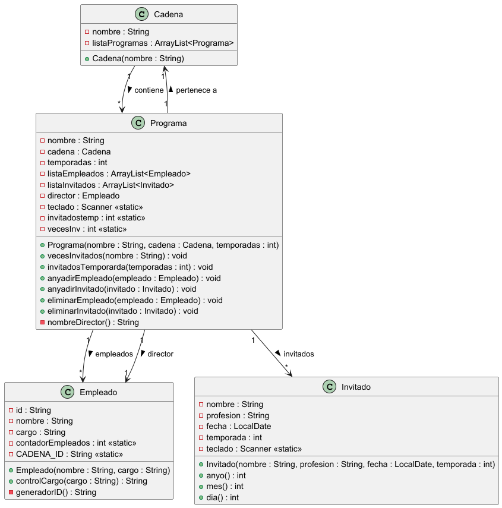

# Practica 1. Practica de compra-venta de casas

## ÍNDICE
1. [Intro](https://github.com/Denis-24/Programacion_objetos/new/main/Programacion_objestos/src/main/java/Practica_1#1-intro)
2. [Estructura de clases](https://github.com/Denis-24/Programacion_objetos/new/main/Programacion_objestos/src/main/java/Practica_1#2estructura-de-clases)
  - Diagrama de clases UML
  - Codigo de PlantUML
  - Contenido de clase (.java)
3. [Programa principal](https://github.com/Denis-24/Programacion_objetos/new/main/Programacion_objestos/src/main/java/Practica_1#3-programa-principal)
4. [Pruebas](https://github.com/Denis-24/Programacion_objetos/new/main/Programacion_objestos/src/main/java/Practica_1#4-pruebas)
5. [Entrega](https://github.com/Denis-24/Programacion_objetos/new/main/Programacion_objestos/src/main/java/Practica_1#5-entregas)

## 1. Intro
> La practica consiste en una app que recoja datos diarios sobre estos programas para dar objetividad a las distintas
informaciones que van apareciendo. 

### 2.Estructura de clases
#### Diagrama de clases UML


#### Codigo de PlantUml
````
@startuml

class Cadena {
    - nombre : String
    - listaProgramas : ArrayList<Programa>

    + Cadena(nombre : String)
}

class Programa {
    - nombre : String
    - cadena : Cadena
    - temporadas : int
    - listaEmpleados : ArrayList<Empleado>
    - listaInvitados : ArrayList<Invitado>
    - director : Empleado
    - teclado : Scanner <<static>>
    - invitadostemp : int <<static>>
    - vecesInv : int <<static>>

    + Programa(nombre : String, cadena : Cadena, temporadas : int)
    + vecesInvitados(nombre : String) : void
    + invitadosTemporarda(temporadas : int) : void
    + anyadirEmpleado(empleado : Empleado) : void
    + anyadirInvitado(invitado : Invitado) : void
    + eliminarEmpleado(empleado : Empleado) : void
    + eliminarInvitado(invitado : Invitado) : void
    - nombreDirector() : String
}

class Empleado {
    - id : String
    - nombre : String
    - cargo : String
    - contadorEmpleados : int <<static>>
    - CADENA_ID : String <<static>>

    + Empleado(nombre : String, cargo : String)
    + controlCargo(cargo : String) : String
    - generadorID() : String
}

class Invitado {
    - nombre : String
    - profesion : String
    - fecha : LocalDate
    - temporada : int
    - teclado : Scanner <<static>>

    + Invitado(nombre : String, profesion : String, fecha : LocalDate, temporada : int)
    + anyo() : int
    + mes() : int
    + dia() : int
}

Cadena "1" --> "*" Programa : contiene >
Programa "1" --> "1" Cadena : pertenece a >
Programa "1" o-- "*" Empleado : empleados >
Programa "1" o-- "*" Invitado : invitados >
Programa "1" --> "1" Empleado : director >

@enduml

````

#### Contenedor de las clases (.java)
- Clase **Cadena**:
````
package Practica_1;

import java.util.ArrayList;

public class Cadena {
    private String nombre;
    private ArrayList<Programa> listaProgramas;


    public Cadena(String nombre){
        this.nombre=nombre;
        listaProgramas = new ArrayList<>();
    }

    public String getNombre() {
        return nombre;
    }

    public void setNombre(String nombre) {
        this.nombre = nombre;
    }

    public ArrayList<Programa> getListaProgramas() {
        return listaProgramas;
    }

    public void setListaProgramas(ArrayList<Programa> listaProgramas) {
        this.listaProgramas = listaProgramas;
    }

    @Override
    public String toString() {
        return "Cadena{" +
                "nombre='" + nombre + '\'' +
                ", listaProgramas=" + listaProgramas +
                '}';
    }
}


````
Link a clase [**Cadena**](https://github.com/Denis-24/Programacion_objetos/blob/main/Programacion_objestos/src/main/java/Practica_1/Cadena.java)

- Clase **Programa**:
  ````
  package Practica_1;

  import java.util.ArrayList;
  import java.util.Scanner;

  public class Programa {
    static Scanner teclado = new Scanner(System.in);
    private static int invitadostemp = 0;
    private static int vecesInv = 0;
    private String nombre;
    private Cadena cadena;
    private int temporadas;
    private ArrayList<Empleado> listaEmpleados;
    private ArrayList<Invitado> listaInvitados;
    private Empleado director;

    public Programa(String nombre, Cadena cadena, int temporadas){
        this.nombre= nombre;
        this.cadena = cadena;
        director = new Empleado(nombreDirector(),"director");
        this.temporadas = temporadas;
        listaEmpleados  = new ArrayList<>();
        listaInvitados = new ArrayList<>();
        listaEmpleados.add(director);
    }

    public void vecesInvitados(String nombre){
        for (int i = 0; i < listaInvitados.size(); i++) {
            if (listaInvitados.get(i).equals(nombre)){
                System.out.println("");
            }
        }
    }

    public void invitadosTemporarda(int temporadas){

        System.out.println("El total de invitados son: " + invitadostemp);

        for (int i = 0; i < listaInvitados.size(); i++) {
            if (listaInvitados.get(i).getTemporada() == temporadas){
                System.out.println("El invitado " + listaInvitados.get(i).getNombre() + " con profesion " + listaInvitados.get(i).getProfesion() + " a participado en la temporada " + temporadas + " del programa " + nombre + ".");
            }
        }
    }

    public void anyadirEmpleado(Empleado empleado){
        if (listaEmpleados.contains(empleado)){
            System.out.println("Este empleado ya esta en la lista");
        }else {
            listaEmpleados.add(empleado);
            System.out.println("Se ha añadido el " + empleado.getCargo() + " llamado " + empleado.getNombre() + " a la lista.");
        }
    }

    public void anyadirInvitado(Invitado invitado){
        if (listaInvitados.contains(invitado)){
            System.out.println("El invitado " + invitado.getNombre() + " ya esta en la lista.");
        }else {
            listaInvitados.add(invitado);
            System.out.println("El invitado llamado " + invitado.getNombre() + " se ha añadidio a la lista");
            invitadostemp++;
            vecesInv++;
        }
    }

    public void eliminarEmpleado(Empleado empleado){
        if (listaEmpleados.contains(empleado)){
            listaEmpleados.remove(empleado);
            System.out.println("El empleado " + empleado.getNombre() + " con el cargo " + empleado.getCargo() + " a sido eliminado de la lista.");
        }else {
            System.out.println("El empleado llamado " + empleado.getNombre() + " no se encuentra en la lista");
        }
    }

    public void eliminarInvitado(Invitado invitado){
        if (listaInvitados.contains(invitado)){
            listaInvitados.remove(invitado);
            System.out.println("El invitado llamado " + invitado.getNombre() + " a sido eliminado de la lista");
            invitadostemp--;
        }else {
            System.out.println("El invitado llamado " + invitado.getNombre() + " no se encuentra en la lista");
        }
    }


    public static Scanner getTeclado() {
        return teclado;
    }

    public static void setTeclado(Scanner teclado) {
        Programa.teclado = teclado;
    }

    public String getNombre() {
        return nombre;
    }

    public void setNombre(String nombre) {
        this.nombre = nombre;
    }

    public Cadena getCadena() {
        return cadena;
    }

    public void setCadena(Cadena cadena) {
        this.cadena = cadena;
    }

    public int getTemporadas() {
        return temporadas;
    }

    public void setTemporadas(int temporadas) {
        this.temporadas = temporadas;
    }

    public ArrayList<Empleado> getListaEmpleados() {
        return listaEmpleados;
    }

    public void setListaEmpleados(ArrayList<Empleado> listaEmpleados) {
        this.listaEmpleados = listaEmpleados;
    }

    public ArrayList<Invitado> getListaInvitados() {
        return listaInvitados;
    }

    public void setListaInvitados(ArrayList<Invitado> listaInvitados) {
        this.listaInvitados = listaInvitados;
    }

    public Empleado getDirector() {
        return director;
    }

    public void setDirector(Empleado director) {
        this.director = director;
    }

    private String nombreDirector(){
        System.out.println("Cual es el nombre del director del programa " + getNombre());
        String nombredir = teclado.next();
        return nombredir;
    }


    @Override
    public String toString() {
        return "Programa{" +
                "nombre='" + nombre + '\'' +
                ", cadena=" + cadena +
                ", temporadas=" + temporadas +
                ", listaEmpleados=" + listaEmpleados +
                ", listaInvitados=" + listaInvitados +
                ", director=" + director +
                '}';
    }
  }

  ````
  Link a clase [**Programa**](https://github.com/Denis-24/Programacion_objetos/blob/main/Programacion_objestos/src/main/java/Practica_1/Programa.java)

  - Clase **Empleado**:
    ````
    package Practica_1;

    public class Empleado {
    private static final String CADENA_ID = "EP ";
    private static int contadorEmpleados = 1;

    private String id;
    private String nombre;
    private String cargo;

    public Empleado(String nombre, String cargo){
        id= generadorID();
        contadorEmpleados++;
        this.nombre = nombre;
        this.cargo = controlCargo(cargo);
    }

    public String controlCargo(String cargo){
        if (cargo == "director" || cargo == "técnico" || cargo == "presentador" || cargo == "colaborador"){
            return cargo;
        }else {
            return "pte";
        }
    }


    public static int getContadorEmpleados() {
        return contadorEmpleados;
    }

    public static void setContadorEmpleados(int contadorEmpleados) {
        Empleado.contadorEmpleados = contadorEmpleados;
    }

    public String getId() {
        return id;
    }

    public void setId(String id) {
        this.id = id;
    }

    public String getNombre() {
        return nombre;
    }

    public void setNombre(String nombre) {
        this.nombre = nombre;
    }

    public String getCargo() {
        return cargo;
    }

    public void setCargo(String cargo) {
        this.cargo = cargo;
    }


    private String generadorID(){
        return CADENA_ID + contadorEmpleados;
    }


    @Override
    public String toString() {
        return "Empleado{" +
                "id='" + id + '\'' +
                ", nombre='" + nombre + '\'' +
                ", cargo='" + cargo + '\'' +
                '}';
    }
    }

    ````
    Link a clase [**Empleado**](https://github.com/Denis-24/Programacion_objetos/blob/main/Programacion_objestos/src/main/java/Practica_1/Empleado.java)
    
     - Clase **Invitado**:
       ````
       package Practica_1;

        import java.time.LocalDate;
        import java.util.Scanner;

        public class Invitado {
        static Scanner teclado = new Scanner(System.in);

        private String nombre;
        private String profesion;
        private LocalDate fecha;
        private int temporada;


        public Invitado(String nombre, String profesion,LocalDate fecha, int temporada){
          this.nombre = nombre;
          this.profesion = profesion;
          setFecha(fecha);
          this.temporada = temporada;
        }


        public int anyo(){
          System.out.println("En que año tines el programa?");
          int anyo  = teclado.nextInt();
          return anyo;
        }
        public int mes(){
          System.out.println("En que mes tienes el programa");
          int mes = teclado.nextInt();
          return mes;
        }
        public int dia(){
         System.out.println("En que dia tienes el programa");
          int dia = teclado.nextInt();
          return dia;
        }

        public String getNombre() {
          return nombre;
        }

        public void setNombre(String nombre) {
          this.nombre = nombre;
        }

        public String getProfesion() {
          return profesion;
        }

        public void setProfesion(String profesion) {
          this.profesion = profesion;
        }

        public LocalDate getFecha() {
          return fecha;
        }

        public void setFecha(LocalDate fecha) {
          this.fecha = fecha;
        }

        public int getTemporada() {
          return temporada;
        }

        public void setTemporada(int temporada) {
          this.temporada = temporada;
        }

        @Override
        public String toString() {
          return "Invitado{" +
                "nombre='" + nombre + '\'' +
                ", profesion='" + profesion + '\'' +
                ", fecha=" + fecha +
                ", temporada=" + temporada +
                '}';
          }
        }

       ````
Link a clase [**Invitado**](https://github.com/Denis-24/Programacion_objetos/blob/main/Programacion_objestos/src/main/java/Practica_1/Invitado.java)
    

### 3. Programa principal
- Programa **Principal**:
  ````
  package Practica_1;

  import java.time.LocalDate;

  public class AppProgramas {
    static void main(String[] args) {

        Invitado i1 = new Invitado("angel","estudiante", LocalDate.of(2025, 3,15),2);
        Invitado i2 = new Invitado("Roberto", "Ingeniero", LocalDate.of(2025,6,9),2);
    //
        Empleado e1 = new Empleado("eric", "ceo");
    //
        Cadena c1 = new Cadena("clan");
        Programa p1 = new Programa("prueba",c1,3);
        Empleado e2 = new Empleado("adrian","colaborador");

         System.out.println(e2.getCargo());
        System.out.println(e1.getCargo());

        p1.anyadirEmpleado(e1);
        p1.eliminarEmpleado(e1);
        p1.eliminarEmpleado(e1);
        System.out.println();
       p1.anyadirEmpleado(e2);
        p1.anyadirEmpleado(e2);

        System.out.println(e1.getId());
        System.out.println();

        System.out.println(i1.getFecha());
        System.out.println(i2.getFecha());
        System.out.println();

        p1.anyadirInvitado(i1);
        p1.eliminarInvitado(i1);
        p1.eliminarInvitado(i1);
        p1.anyadirInvitado(i1);
        p1.anyadirInvitado(i2);

        p1.invitadosTemporarda(2);
        
        System.out.println();

        System.out.println(i1.getFecha());
        i1.setFecha(LocalDate.of(i1.anyo(),i1.mes(), i1.dia()));
        System.out.println(i1.getFecha());

         System.out.println();
        System.out.println();

        Cadena antena3 = new Cadena("Antena 3");
        System.out.println(antena3);

        Programa el_hormiguero = new Programa("El Hormiguero",antena3,3);
        System.out.println(el_hormiguero);
        System.out.println(antena3);
        System.out.println();

        el_hormiguero.anyadirEmpleado("Pablo Motos","presentador",null);

        System.out.println(el_hormiguero.getListaEmpleados());

       el_hormiguero.anyadirInvitado("Aitana","cantante",1);

        System.out.println(el_hormiguero.getListaInvitados());


      }
    }
    ````
Link a programa [**Principal**](https://github.com/Denis-24/Programacion_objetos/blob/main/Programacion_objestos/src/main/java/Practica_1/AppProgramas.java)

### 4. Pruebas

Arhivo de las Pruebas: [Pracica_1_Rico_Renz_Denis.pdf](https://github.com/user-attachments/files/25131963/Pracica_1_Rico_Renz_Denis.pdf)


### 5. Entregas
- [X] Codigo fuente en Github: [Link]()
- [X] Documentacion
- [X] Pruebas
