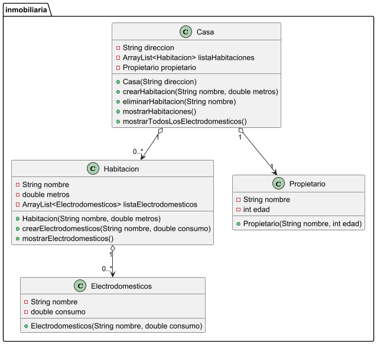

# Practica 1. Practica de compra-venta de casas

## ÍNDICE
1. [Intro](https://github.com/Denis-24/Programacion_objetos/new/main/Programacion_objestos/src/main/java/Practica_1#1-intro)
2. [Estructura de clases](https://github.com/Denis-24/Programacion_objetos/new/main/Programacion_objestos/src/main/java/Practica_1#2estructura-de-clases)
  - Diagrama de clases UML
  - Codigo de PlantUML
  - Contenido de clase (.java)
3. [Programa principal](https://github.com/Denis-24/Programacion_objetos/new/main/Programacion_objestos/src/main/java/Practica_1#3-programa-principal)
4. [Pruebas](https://github.com/Denis-24/Programacion_objetos/new/main/Programacion_objestos/src/main/java/Practica_1#4-pruebas)
5. [Entrega](https://github.com/Denis-24/Programacion_objetos/new/main/Programacion_objestos/src/main/java/Practica_1#5-entregas)

## 1. Intro
> La practica consiste en una app

### 2.Estructura de clases
#### Diagrama de clases UML


#### Codigo de PlantUml
````
@startuml
package inmobiliaria {

    class Casa {
        - String direccion
        - ArrayList<Habitacion> listaHabitaciones
        - Propietario propietario

        + Casa(String direccion)
        + crearHabitacion(String nombre, double metros)
        + eliminarHabitacion(String nombre)
        + mostrarHabitaciones()
        + mostrarTodosLosElectrodomesticos()
    }

    class Habitacion {
        - String nombre
        - double metros
        - ArrayList<Electrodomesticos> listaElectrodomesticos

        + Habitacion(String nombre, double metros)
        + crearElectrodomesticos(String nombre, double consumo)
        + mostrarElectrodomesticos()
    }

    class Electrodomesticos {
        - String nombre
        - double consumo

        + Electrodomesticos(String nombre, double consumo)
    }

    class Propietario {
        - String nombre
        - int edad

        + Propietario(String nombre, int edad)
    }

    Casa "1" o--> "0..*" Habitacion
    Habitacion "1" o--> "0..*" Electrodomesticos
    Casa "1" o--> "1" Propietario
}
@enduml
````

#### Contenedor de las clases (.java)
- Clase **Casa**:
````
package inmobiliaria;

import java.util.ArrayList;
import java.util.Scanner;
import java.util.Stack;

public class Casa {

    static Scanner teclado = new Scanner(System.in);

    private String direccion;
    private ArrayList<Habitacion> listaHabitaciones;
    private Propietario propietario;

    public Casa (String direccion){
        this.direccion=direccion;
        listaHabitaciones = new ArrayList<>();
        setPropietario();
    }

    public void crearHabitacion(String nombre, double metros){
        for (Habitacion habitacion : listaHabitaciones){
            if (habitacion.getNombre().equals(nombre)){
                System.out.println("La habitacion " + habitacion.getNombre() + " ya existe");
                return;
            }
        }
        Habitacion habitacion = new Habitacion(nombre,metros);
        listaHabitaciones.add(habitacion);
        System.out.println("Habitacion " + nombre + " creada.");
    }

    public void eliminarHabitacion(String nombre){

        for (Habitacion habitacion :listaHabitaciones){
            if (habitacion.getNombre().equals(nombre)){
                listaHabitaciones.remove(nombre);
                System.out.println("La habitacion " + habitacion.getNombre() + " ha sido borrado");
                return;
            }
        }
        System.out.println("La habitacion " + nombre + " no existe");

    }

    public void mostrarHabitaciones(){
        System.out.println("Casa en " + direccion + " tiene " + listaHabitaciones.size() + " habitaciones, cuyo propietario es " + propietario.getNombre());
        for (Habitacion habitacion : listaHabitaciones){
            System.out.println("- " + habitacion.getNombre() + " (" + habitacion.getMetros() + ") m2");
        }
    }

    public void mostrarTodosLosElectrodomesticos(){
        for (int i = 0; i < listaHabitaciones.size(); i++) {
            System.out.println();
            System.out.println("Los electrodomesticos de la habitacion " + listaHabitaciones.get(i).getNombre() + " son: ");
            listaHabitaciones.get(i).mostrarElectrodomesticos();
        }
    }

    public Habitacion getHabitacionMasGrande(){

        Habitacion mayor = listaHabitaciones.get(0);
        for (Habitacion habitacion : listaHabitaciones) {

            if (habitacion.getMetros() > mayor.getMetros()){
                mayor=habitacion;
            }
        }
        return mayor;
    }


    public String getDireccion() {
        return direccion;
    }

    public void setDireccion(String direccion) {
        this.direccion = direccion;
    }

    public ArrayList<Habitacion> getListaHabitaciones() {
        return listaHabitaciones;
    }

    public void setListaHabitaciones(ArrayList<Habitacion> listaHabitaciones) {
        this.listaHabitaciones = listaHabitaciones;
    }

    public Propietario getPropietario() {
        return propietario;
    }

    public void setPropietario() {
        System.out.println("Introduce el nombre del propietario");
        String nombrePropietario = teclado.next();
        teclado.nextLine();
        System.out.println("Introduce la edad del propietario");
        int edad = teclado.nextInt();
        teclado.nextLine();
        Propietario propietario = new Propietario(nombrePropietario,edad);
        this.propietario = propietario;
        System.out.println("Propietario " + nombrePropietario + " ha sido añadido");
    }

    @Override
    public String toString() {
        return "Casa{" +
                "direccion='" + direccion + '\'' +
                ", listaHabitaciones=" + listaHabitaciones +
                ", propietario=" + propietario +
                '}';
    }
}

````
Link a clase [**Casa**](https://github.com/Denis-24/Programacion_objetos/blob/main/Programacion_objestos/src/main/java/inmobiliaria/Casa.java)


### 3. Programa principal
> [!NOTE]
> Useful information that users should know, even when skimming content.

> [!TIP]
> Helpful advice for doing things better or more easily.

> [!IMPORTANT]
> Key information users need to know to achieve their goal.

> [!WARNING]
> Urgent info that needs immediate user attention to avoid problems.

> [!CAUTION]
> Advises about risks or negative outcomes of certain actions.


### 4. Pruebas


### 5. Entregas
- [X] Codigo fuente en Github: [Link]()
- [ ] Documentacion
- [ ] Pruebas
